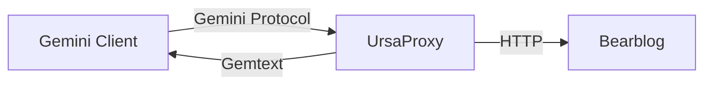
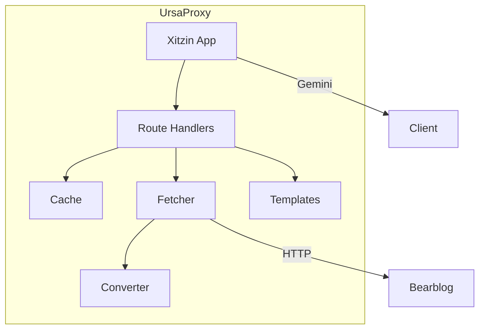

# Architecture

This article explains how UrsaProxy is structured and how its components work together.

## High-Level Overview

UrsaProxy is a proxy server that sits between Gemini clients and your Bearblog:



When a client requests content:

1. UrsaProxy receives the Gemini request
2. Checks its cache for the content
3. If not cached, fetches from Bearblog via HTTP
4. Converts HTML to Gemtext
5. Caches the result
6. Returns Gemtext to the client

## Component Overview



### Core Modules

| Module | Purpose |
|--------|---------|
| `__init__.py` | Xitzin app, routes, entry point |
| `config.py` | Environment-based configuration |
| `fetcher.py` | HTTP client for Bearblog |
| `converter.py` | HTML to Gemtext conversion |
| `cache.py` | TTL-based caching |

## The Xitzin Framework

UrsaProxy is built on [Xitzin](https://xitzin.readthedocs.io), a Gemini server framework with an API similar to FastAPI.

### App Factory Pattern

UrsaProxy uses a factory pattern for flexibility:

```python
from ursaproxy import create_app, Settings

# Create settings
settings = Settings(
    bearblog_url="https://example.bearblog.dev",
    blog_name="My Blog",
)

# Create app instance
app = create_app(settings)
```

This allows:

- **Embedding**: Mount UrsaProxy in other Xitzin apps for virtual hosting
- **Testing**: Create isolated app instances with different settings
- **Multiple instances**: Run multiple proxies for different blogs

Xitzin provides:

- Route handling with path parameters
- TLS/SSL management
- Request/response abstraction
- Lifecycle hooks (startup/shutdown)

## Request Flow

### 1. Route Matching

When a request arrives, Xitzin matches it to a route:

| URL Pattern | Handler |
|-------------|---------|
| `/` | `index()` - Landing page |
| `/post/{slug}` | `post()` - Blog posts |
| `/page/{slug}` | `page()` - Static pages |
| `/about` | `about()` - About page |
| `/feed` | `feed()` - Atom feed |

### 2. Cache Check

Before fetching, the handler checks the cache:

```python
if cached := cache.get(cache_key, settings.cache_ttl_post):
    return cached  # Return immediately
```

### 3. Content Fetching

If not cached, the fetcher retrieves content:

```python
html = await fetch_html(client, slug)
```

This uses `httpx` for async HTTP requests with proper error handling.

### 4. Conversion

The HTML is converted to Gemtext:

```python
content = html_to_gemtext(html)
```

See [Conversion Pipeline](conversion-pipeline.md) for details.

### 5. Template Rendering

Jinja2 templates generate the final Gemtext:

```python
template = templates.get_template("post.gmi")
gemtext = template.render(title=title, content=content, ...)
```

### 6. Caching and Response

The result is cached and returned:

```python
cache.set(cache_key, gemtext)
return gemtext
```

## Caching Strategy

The cache is a simple TTL-based dictionary:

```python
class Cache:
    def __init__(self, max_size: int = 1000):
        self._data: dict[str, tuple[Any, float]] = {}
        self._max_size = max_size
```

Key features:

- **TTL-based expiry**: Items expire after a configurable time
- **Size limit**: Maximum 1000 entries to prevent memory issues
- **LRU eviction**: Oldest entries removed when full

### Cache Keys

| Content Type | Cache Key |
|-------------|-----------|
| RSS Feed | `"feed"` |
| Blog post | `"post:{slug}"` |
| Static page | `"page:{slug}"` |

## Error Handling

UrsaProxy maps HTTP errors to Gemini status codes:

| HTTP Status | Gemini Response |
|-------------|-----------------|
| 404 Not Found | `51 NOT FOUND` |
| 5xx Server Error | `40 TEMPORARY FAILURE` |
| Network Error | `40 TEMPORARY FAILURE` |

This uses Xitzin's exception system:

```python
from xitzin import NotFound, TemporaryFailure

try:
    html = await fetch_html(client, slug)
except NotFoundError as e:
    raise NotFound(str(e))
except ServerError as e:
    raise TemporaryFailure(str(e))
```

## Lifecycle Management

### Startup

On startup, UrsaProxy initializes a shared HTTP client:

```python
@app.on_startup
async def startup() -> None:
    app.state.client = httpx.AsyncClient(timeout=30.0)
```

### Shutdown

On shutdown, the client is properly closed:

```python
@app.on_shutdown
async def shutdown() -> None:
    await app.state.client.aclose()
```

## Configuration

Settings can come from a TOML file or environment variables:

```python
from pydantic_settings import BaseSettings, SettingsConfigDict

class Settings(BaseSettings):
    model_config = SettingsConfigDict(toml_file="ursaproxy.toml")

    bearblog_url: str
    blog_name: str
    cache_ttl_feed: int = 300
    # ...
```

Priority order: environment variables > TOML file > defaults.

For standalone use, `load_settings()` handles configuration loading:

```python
from ursaproxy import create_app, load_settings

app = create_app(load_settings())
```

For embedding, create settings directly:

```python
from ursaproxy import create_app, Settings

settings = Settings(bearblog_url="...", blog_name="...")
app = create_app(settings)
```

See [Configuration Reference](../reference/configuration.md) for all options.

## See Also

- [Conversion Pipeline](conversion-pipeline.md) - HTML to Gemtext details
- [Gemini Protocol](gemini-protocol.md) - Understanding Gemini
- [API Reference](../reference/api.md) - Module documentation
