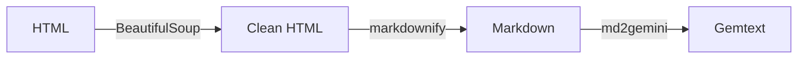

# Conversion Pipeline

This article explains how UrsaProxy converts HTML from Bearblog into Gemtext for Gemini clients.

## The Challenge

Bearblog produces HTML like this:

```html
<main>
  <h1>My Blog Post</h1>
  <time datetime="2024-01-15">January 15, 2024</time>
  <p>This is the <strong>first</strong> paragraph with a
     <a href="https://example.com">link</a>.</p>
  <h2>A Subheading</h2>
  <ul>
    <li>Item one</li>
    <li>Item two</li>
  </ul>
</main>
<nav>...</nav>
<footer>...</footer>
```

Gemini needs:

```gemtext
# My Blog Post

2024-01-15

This is the first paragraph with a link.

=> https://example.com link

## A Subheading

* Item one
* Item two
```

The conversion must:

1. Extract content from `<main>`
2. Remove navigation, footer, scripts
3. Handle inline formatting (bold, italic → plain text)
4. Move links to their own lines
5. Preserve structure (headings, lists)

## Three-Stage Pipeline

UrsaProxy uses a three-stage conversion:



### Stage 1: HTML Cleaning (BeautifulSoup)

First, we extract and clean the HTML:

```python
from bs4 import BeautifulSoup

soup = BeautifulSoup(html, "html.parser")

# Bearblog uses <main> for content
main = soup.find("main")

# Remove unwanted elements
for tag in main.find_all(["script", "style", "nav", "footer", "form"]):
    tag.decompose()

# Remove the h1 (handled separately)
if h1 := main.find("h1"):
    h1.decompose()
```

This stage:

- Locates the main content area
- Removes scripts, styles, navigation
- Separates title from body content

### Stage 2: HTML to Markdown (markdownify)

Next, we convert clean HTML to Markdown:

```python
from markdownify import markdownify

markdown = markdownify(str(main), heading_style="ATX")
```

Input:
```html
<p>This is <strong>bold</strong> and <em>italic</em>.</p>
<h2>Heading</h2>
<a href="https://example.com">A link</a>
```

Output:
```markdown
This is **bold** and *italic*.

## Heading

[A link](https://example.com)
```

This stage handles:

- Paragraph structure
- Inline formatting
- Links (inline style)
- Lists
- Headings

### Stage 3: Markdown to Gemtext (md2gemini)

Finally, we convert Markdown to Gemtext:

```python
from md2gemini import md2gemini

gemtext = md2gemini(markdown, links="paragraph", plain=True)
```

The `plain=True` option strips inline formatting (bold, italic) since Gemtext doesn't support them.

The `links="paragraph"` option moves links to their own lines after the paragraph.

Input:
```markdown
This is **bold** with a [link](https://example.com).
```

Output:
```gemtext
This is bold with a link.

=> https://example.com link
```

## Why Three Stages?

Why not convert HTML directly to Gemtext?

1. **Separation of concerns**: Each library does one thing well
2. **Flexibility**: The intermediate Markdown could be used elsewhere
3. **Mature libraries**: markdownify and md2gemini are well-tested
4. **Maintainability**: Easier to debug each stage

## Handling Edge Cases

### Images

Images in HTML are converted to links:

```html

```

Becomes:

```gemtext
=> photo.jpg My photo
```

### Code Blocks

Preformatted code is preserved:

```html
<pre><code>def hello():
    print("Hello!")</code></pre>
```

Becomes:

`````gemtext
```
def hello():
    print("Hello!")
```
`````

### Tables

HTML tables become preformatted text (Gemtext has no table support):

```html
<table>
  <tr><td>A</td><td>B</td></tr>
</table>
```

Becomes:

`````gemtext
```
A  B
```
`````

### Nested Lists

Nested lists are flattened (Gemtext only supports one level):

```html
<ul>
  <li>Item
    <ul><li>Nested</li></ul>
  </li>
</ul>
```

Becomes:

```gemtext
* Item
* Nested
```

## Metadata Extraction

Separate from content conversion, UrsaProxy extracts metadata:

```python
def extract_metadata(html: str) -> tuple[str, str]:
    soup = BeautifulSoup(html, "html.parser")

    # Title from h1
    h1 = soup.find("h1")
    title = h1.get_text(strip=True) if h1 else "Untitled"

    # Date from <time datetime="...">
    time_el = soup.find("time")
    date_str = time_el["datetime"] if time_el else ""

    return title, date_str
```

This allows the title and date to be displayed in the template header, separate from the body content.

## Slug Extraction

URLs are converted to slugs for routing:

```python
def extract_slug(url: str) -> str:
    # "https://blog.example.com/my-post/" → "my-post"
    path = url.rstrip("/").split("/")[-1]
    return path
```

## Conversion Quality

The conversion is "lossy" by design:

| HTML Feature | Gemtext Result |
|--------------|----------------|
| Bold/italic | Plain text |
| Inline code | Plain text |
| Tables | Preformatted block |
| Colors/styles | Removed |
| Images | Links |
| Videos | Links (if present) |

This is intentional—Gemini prioritizes simplicity over formatting.

## See Also

- [Architecture](architecture.md) - Overall system design
- [Gemini Protocol](gemini-protocol.md) - Understanding Gemtext
