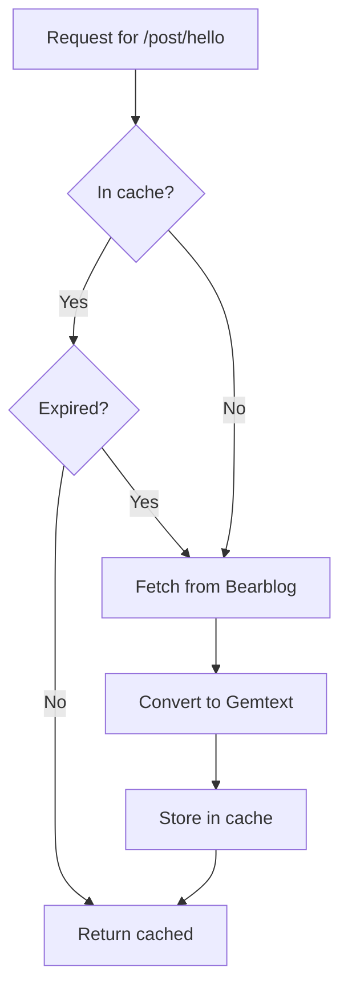

# Caching

This guide explains how to configure UrsaProxy's caching to balance content freshness and performance.

## How Caching Works

UrsaProxy caches two types of content:

1. **Feed data** - The RSS feed from your Bearblog
2. **Post/page content** - Individual pages converted to Gemtext

Each has a separate TTL (Time To Live) controlling how long cached content is used before fetching fresh data.

## Default Settings

| Setting | Default | Description |
|---------|---------|-------------|
| `CACHE_TTL_FEED` | 300 (5 min) | How long to cache the RSS feed |
| `CACHE_TTL_POST` | 1800 (30 min) | How long to cache individual posts |

## Configuring Cache TTLs

### Feed Cache

The feed cache affects:

- Landing page post list
- About page metadata
- Atom feed generation

```bash
# Cache feed for 10 minutes
export CACHE_TTL_FEED="600"

# Cache feed for 1 hour
export CACHE_TTL_FEED="3600"
```

**Lower values**: New posts appear faster, more requests to Bearblog.

**Higher values**: Fewer requests, posts take longer to appear.

### Post Cache

The post cache affects individual post and page content.

```bash
# Cache posts for 1 hour
export CACHE_TTL_POST="3600"

# Cache posts for 4 hours
export CACHE_TTL_POST="14400"
```

**Lower values**: Edits appear faster, more processing overhead.

**Higher values**: Better performance, edits take longer to appear.

## Recommended Settings

### High-Traffic Capsule

For capsules with many visitors:

```bash
export CACHE_TTL_FEED="600"    # 10 minutes
export CACHE_TTL_POST="3600"   # 1 hour
```

### Actively Edited Blog

If you frequently edit posts:

```bash
export CACHE_TTL_FEED="300"    # 5 minutes
export CACHE_TTL_POST="600"    # 10 minutes
```

### Low-Activity Blog

For blogs updated infrequently:

```bash
export CACHE_TTL_FEED="3600"   # 1 hour
export CACHE_TTL_POST="86400"  # 24 hours
```

## Cache Size Limits

The cache has a built-in size limit of 1000 entries. When full, the oldest 10% of entries are evicted.

This prevents memory issues on high-traffic capsules with many unique posts.

## Cache Behavior



## Forcing Cache Refresh

Currently, there's no way to manually clear the cache without restarting UrsaProxy. Restarting clears all cached content:

```bash
# Stop and restart
pkill -f ursaproxy
ursaproxy
```

## Monitoring Cache Performance

UrsaProxy doesn't currently expose cache metrics. You can monitor indirectly by:

1. Checking response times (cached responses are faster)
2. Monitoring Bearblog access logs for request patterns

## See Also

- [Configuration Reference](../reference/configuration.md) - All settings
- [Architecture](../explanation/architecture.md) - How caching fits into the system
