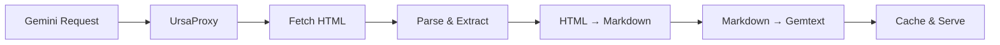

# Your First Proxy

In this tutorial, you'll set up UrsaProxy to serve your Bearblog content over the Gemini protocol.

## What You'll Learn

- How to install and configure UrsaProxy
- How to generate TLS certificates for Gemini
- How to connect with a Gemini client
- How the conversion pipeline works

## What We'll Build

By the end of this tutorial, you'll have a working Gemini proxy that:

- Serves your Bearblog posts as Gemtext
- Provides an index page with recent posts
- Generates an Atom feed for Gemini clients

## Prerequisites

- Python 3.13 or later
- A Bearblog with published posts
- A Gemini client (we'll use [Lagrange](https://gmi.skyjake.fi/lagrange/), [Amfora](https://github.com/makew0rld/amfora), or [Astromo](https://github.com/alanbato/astronomo))

## Step 1: Create a Project Directory

Create a directory for your proxy setup:

```bash
mkdir my-gemini-blog
cd my-gemini-blog
```

## Step 2: Install UrsaProxy

Install UrsaProxy using uv:

```bash
uv init
uv add ursaproxy
```

Or with pip in a virtual environment:

```bash
python -m venv .venv
source .venv/bin/activate  # On Windows: .venv\Scripts\activate
pip install ursaproxy
```

## Step 3: Generate TLS Certificates

Gemini requires TLS for all connections. For local development, create a self-signed certificate:

```bash
openssl req -x509 -newkey rsa:4096 -keyout key.pem -out cert.pem \
    -days 365 -nodes -subj '/CN=localhost'
```

This creates:

- `cert.pem` - Your TLS certificate
- `key.pem` - Your private key

!!! warning "Production Certificates"

    For production, use a proper certificate from Let's Encrypt or another CA. Self-signed certificates will show warnings in most Gemini clients.

## Step 4: Configure Environment Variables

Create a `.env` file or export variables directly:

```bash
export BEARBLOG_URL="https://example.bearblog.dev"
export BLOG_NAME="My Gemini Blog"
export CERT_FILE="./cert.pem"
export KEY_FILE="./key.pem"
```

Replace `https://example.bearblog.dev` with your actual Bearblog URL.

!!! tip "Finding Your Bearblog URL"

    Your Bearblog URL is typically `https://yourusername.bearblog.dev` or your custom domain if you've configured one.

## Step 5: Start the Proxy

Run UrsaProxy:

```bash
ursaproxy
```

You should see:

```
INFO: Xitzin server listening on localhost:1965
```

## Step 6: Connect with a Gemini Client

Open your Gemini client and navigate to:

```
gemini://localhost/
```

You should see your blog's landing page with:

- Your blog name
- A description (from your RSS feed)
- Links to recent posts

Try clicking on a post to see it converted to Gemtext!

## Understanding the Output

Let's look at what UrsaProxy produces. Your landing page looks something like:

```gemtext
# My Gemini Blog

A personal blog about technology and life.

## Recent Posts

=> /post/hello-world 2024-01-15 Hello World
=> /post/second-post 2024-01-10 My Second Post

## More

=> /about About
=> /feed Atom Feed
```

And a post page:

```gemtext
# Hello World

2024-01-15

This is my first blog post! Welcome to my corner of the internet.

I've been meaning to start a blog for a while, and here we are.

## What to Expect

I'll be writing about:

* Technology
* Programming
* Life updates

=> https://example.bearblog.dev/hello-world/ View on web
```

## Step 7: Try the Atom Feed

Navigate to:

```
gemini://localhost/feed
```

This returns an Atom XML feed with Gemini URLs, perfect for Gemini-aware feed readers.

## What's Happening Behind the Scenes

When you request a post, UrsaProxy:

1. **Fetches** the HTML from your Bearblog
2. **Extracts** the main content (strips navigation, scripts, styles)
3. **Converts** HTML to Markdown using markdownify
4. **Converts** Markdown to Gemtext using md2gemini
5. **Caches** the result for future requests
6. **Serves** it over Gemini



## Next Steps

Congratulations! You've set up your first UrsaProxy instance.

<div class="grid cards" markdown>

-   :material-palette: **Customize Templates**

    ---

    Learn how to personalize your Gemini capsule.

    [:octicons-arrow-right-24: Customizing Templates](customizing-templates.md)

-   :material-cog: **Configuration**

    ---

    Explore all configuration options.

    [:octicons-arrow-right-24: Configuration Guide](../how-to/configuration.md)

-   :material-file-document: **Static Pages**

    ---

    Add pages that aren't in your RSS feed.

    [:octicons-arrow-right-24: Static Pages](../how-to/static-pages.md)

</div>
